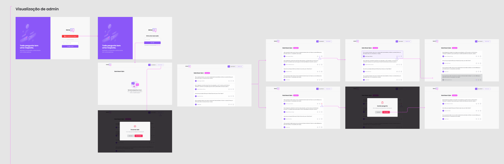
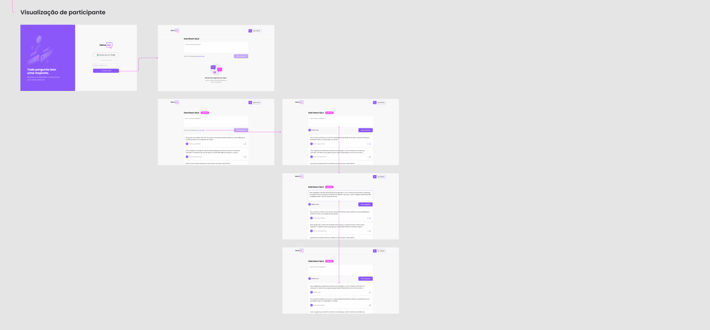

<p align="center">
  
</p>

<p align="center">
  

  

  


  <a href="./LICENSE.md">
  
  </a>
</p>

<br>

# Índice

- [Sobre](#ℹ️-sobre)
- [Etapas](#📁-etapas)
  - [Dia 1 - Configuração de ambiente](#📌-dia-1---configuração-de-ambiente)
  - [Dia 2 - Autenticação](#📌-dia-2---autenticação)
  - [Dia 3 - Fluxo de salas](#📌-dia-3---fluxo-de-salas)
  - [Dia 4 - Interação com salas](#📌-dia-4---interação-com-salas)
  - [Dia 5 - Controles do admin](#📌-dia-5---controles-do-admin)
- [Tecnologias](#🛠-tecnologias)
- [Como rodar o projeto](#⚙️-como-rodar-o-projeto)
- [Autora](#👩‍💼-autora)

<br>

# ℹ️ Sobre

Let me Ask é uma plataforma para criar salas de perguntas e respostas (Q&A) desenvolvida na edição Together da Next Level Week.

<br>

<a href="https://www.figma.com/file/KGnYqR4VcjGOXeBYcPDwXq/Letmeask?node-id=0%3A1">

</a>

<br>


<br>



<br><br>

# 📁 Etapas

## 📌 Dia 1 - Configuração de ambiente

- Configuração do ambiente de desenvolvimento

- Criação do projeto `React` com `Typescript`

- Conexão do projeto com `Firebase`

- Configuração das variáveis ambientes


<br>

## 📌 Dia 2 - Autenticação

- A estilização do projeto utilizou a biblioteca [SASS](https://sass-lang.com/)

- Tela de autenticação

- Tela de criação da sala

- Roteamento e navegação

- Autenticação com Firebase

- Contexto com React

- Recuperação do estado de autenticação

<br>

<!-- ## 📌 Demo:


<br> -->


## 📌 Dia 3 - Fluxo de salas

- Criação de sala 

- Entrado na sala

- Estipulando autorização ⇒ FireBase

- Página de sala

- Criando nova pergunta 

- Consumindo perguntas do Firebase 

- "Ouvindo" novas perguntas

<br>

## 📌 Dia 4 - Interação com salas

- Estrutura das perguntas (HTML e CSS)

- Criando hook `userRoom`

- Página de sala (admin)

- Funcionalidade de like

- Componente de modal

- Remoção de pergunta

- Encerrar a sala

<br>

## 📌 Dia 5 - Controles do admin

- HTML e CSS de destaque e respondida

- Dar destaque na pergunta

- Marcar como respondida

- Hospedando o projeto

<br>

# 🛠 Tecnologias

As seguintes ferramentas foram usadas na construção do projeto:

- [Node.js](https://nodejs.org/en/)
- [React](https://pt-br.reactjs.org/)
- [TypeScript](https://www.typescriptlang.org/)
- [Firebase](https://firebase.google.com/)

<br>

# ⚙️ Como rodar o projeto

- Antes de executar a aplicação crie o arquivo `.env.local` com as variáveis existentes `.env.example`

```bash
# Clone o repositório
$ git clone https://github.com/nlnadialigia/letmeask.git

# Entre no repositório
$ cd letmeask

# Instale as dependências
$ yarn

# Execute a aplicação
$ yarn start
```
<br>

# 👩‍💼 Autora

<p><b>Nádia Ligia, desenvolvedora em construção.</b></p>
<a href="https://www.linkedin.com/in/nlnadialigia/">
  
</a>&nbsp;
<a href="mailto:nlnadialigia@gmail.com">
  
</a>&nbsp;
<a href="https://www.nlnadialigia.com">
  
</a>